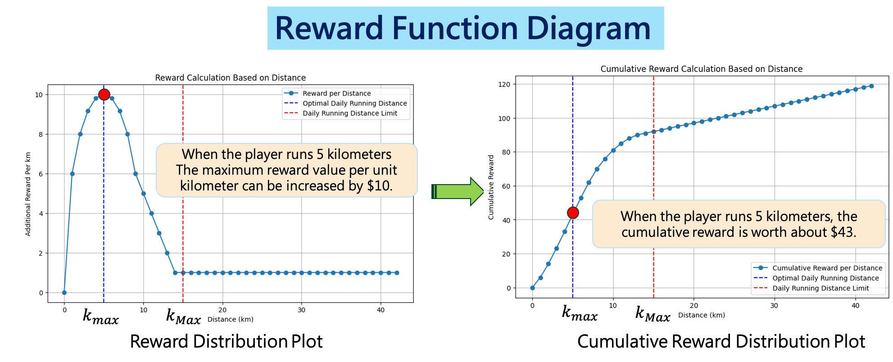

# Move-to-Earn System

## M2E System Architecture Diagram
- Develop an M2E system and establish an O2O strategic alliance with sports shoe manufacturers and insurance companies


## M2E System's Event Flow Chart


## M2E Reward Mechanism
- The reward formula encourages players to develop healthy and regular exercise habits, while also avoiding sports injuries caused by excessive exercise.




```math
\begin{cases} 
r_{\text{Max}} \sqrt{1 - \left( \frac{k - k_{\text{max}}}{k_{\text{max}}} \right)^2}, & \text{if } k < k_{\text{max}} \\
r_{(k-1)}^d - \beta, & \text{if } k_{\text{max}} \leq k < k_{\text{Max}} \\
r_{\text{min}}, & \text{if } k \geq k_{\text{Max}}
\end{cases}
```
    
| Variable            | Definition                              |
|---------------------|-----------------------------------------|
| $r_k^d$             | Reward for running $k$ kilometers        |
| $k$                 | Running distance (kilometers)            |
| $k_{\text{max}}$    | Optimal daily running distance           |
| $k_{\text{Max}}$    | Maximum running distance                 |
| $r_{\text{Max}}$    | Maximum reward value                     |
| $\beta$             | Adjustment coefficient                   |
| $r_{\text{min}}$    | Minimum reward per kilometer             |


## Experimental Environment
### Player Data
- Player ID (player_id)
- Current age (current_age)
- Running frequency (current_dayweek)
- Average daily activity distance (current_kmday)
- Type of sports shoes (current_shoes_type)
- Running location (current_place)
- Expected lifespan of sports shoes (current_mileage)
- Tolerance for shoe wear (current_wear_rate_tolerate)
- Injury probability (hurt_rate)
- Amount of cryptocurrency (keep_amount)
- Selling price (sell_price_rate)
- Selling quantity (sell_amount_rate)
- Expected maximum mileage of the player’s shoes (current_mileage)

### M2E System
- All NFT running shoes are priced at 2000 units
- When a player purchases NFT running shoes, they must first add value. The system presets all players to add 1500 units of in-game tokens as a running fund, including 500 units for insurance. 
- The value-add period is 30 days. If the player's physical running shoes wear out during the exercise, they can use running rewards to purchase physical running shoes from a partner shoe factory, each priced at 2000 units of fiat currency. 
- If the player suffers an injury during exercise, they can file a claim with the insurance company.
- The initial market supply of cryptocurrency is determined by the number of players

### M2E Market
- The initial price of the cryptocurrency is set at **1 unit**, and its default market supply is determined based on the number of players.
- During transactions, the system generates market demand and supply based on the trading behavior of the project team, players, shoe manufacturers, and insurance companies.
- At the end of each day's trading, the system calculates the supply-demand difference ratio  and adjusts the cryptocurrency's price accordingly.
- If there is an excess supply in the market, the project team will purchase cryptocurrency to balance the market . Conversely, if the market supply is too low, the project team will provide cryptocurrency to regulate the price.
- To prevent excessive price volatility, which may cause panic among market participants leading to mass selling or buying, this study aims to keep the market price fluctuations within a range of **0.9 to 1.1** to ensure relative price stability.

## Experimental Design
**Use the Squeeze Theorem to determine the reward weight that keeps the system's profit margin between 0.1 and 0.12.**

The experiment uses multipliers of 1.05 and 0.95 to adjust the Weight.

- When the profit margin exceeds 0.12, the Weight will be increased by a multiplier of 1.05, which increases the reward value for players and decreases the profit margin.
- When the profit margin is below 0.1, the Weight will be decreased by a multiplier of 0.95, which reduces the reward value for players and increases the profit margin.

| No. | Experimental Scenario Content                          | Experiment Duration (minutes) | Number of Participants | Player Data                                                                                  |
|-----|--------------------------------------------------------|-------------------------------|------------------------|----------------------------------------------------------------------------------------------|
| 1   | M2E System Stress Test                                  | 120, 240, 360, 480, 600        | 100, 200, 300, 400, 500 | Professional runners, running daily with a distance of 42 kilometers per session              |
| 2   | Variations in Player Running Habits                     | 120, 240, 360, 480, 600        | 100, 200, 300, 400, 500 | Randomly generated player profiles                                                            |
| 3   | Impact of Different Proportions of Professional Runners on Reward Weights | 480                           | 300                    | Proportion of professional runners among all players: 10%, 20%, 30%, 40%, 50%                 |
| 4   | Impact of Cryptocurrency Market Price Fluctuations on Project Parties and Players | 120, 240                      | 100, 200               | Randomly generated player profiles                                                            |


